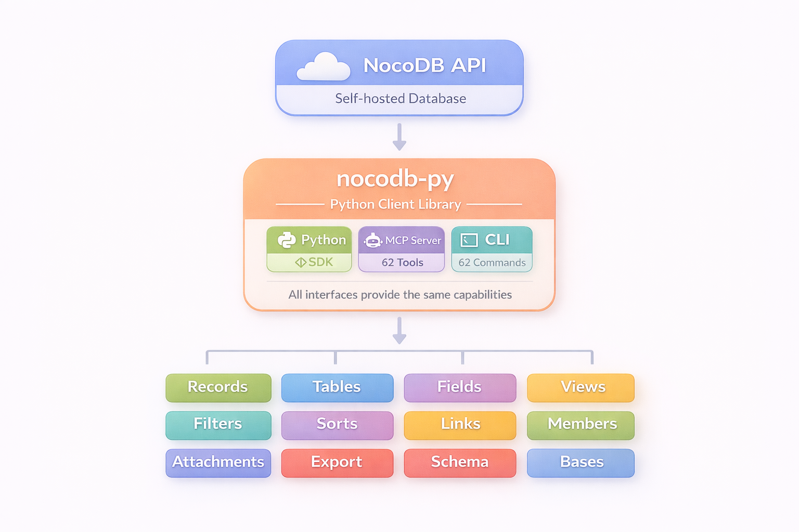

<h1 align="center">nocodb-py</h1>

<h2 align="center"><strong>The Complete Python Toolkit for NocoDB</strong></h2>

<p align="center">
  <a href="https://www.gnu.org/licenses/agpl-3.0"></a>
  <a href="https://www.python.org/downloads/"></a>
</p>

<p align="center">Python SDK + MCP Server + CLI + Telegram Bot for <b>self-hosted</b> NocoDB.</p>

---

## 📰 News

- **2026-02-14** 🤖 nocobot - Telegram bot with NocoDB MCP agent integration
- **2026-02-14** 📦 Monorepo restructure for independent Dokploy deployment
- **2026-02-13** ⌨️ Auto-generated CLI via FastMCP generate-cli
- **2026-02-12** 📚 Doc tools for mcp-remote compatibility
- **2026-02-11** 🚀 FastMCP 3.0 upgrade with Streamable HTTP transport
- **2026-02-11** 📦 Schema export tools and workflow prompts
- **2026-02-11** 🐳 Dokploy deployment guide for remote MCP

---

## Key Features

- 🐍 **Python SDK** - Full v3 Data API + hybrid v2/v3 Meta API
- 🤖 **MCP Server** - 62 tools for Claude Desktop & AI integrations (FastMCP 3.0)
- ⌨️ **CLI** - 62 commands auto-generated from MCP server
- 💬 **nocobot** - Telegram bot with NocoDB MCP agent (OpenRouter LLM)
- 🏠 **Self-Hosted First** - Built for community edition

---

## Monorepo Structure

This repo contains two independently deployable services:

| Service | Path | Description | Dokploy Build Path |
|---------|------|-------------|-------------------|
| **nocodb** | `/nocodb/` | Python SDK + MCP Server + CLI | `/nocodb/` |
| **nocobot** | `/nocobot/` | Telegram bot with MCP agent | `/nocobot/` |

---



---

## Quick Start

### nocodb SDK + MCP Server

```bash
# Install SDK only
pip install git+https://github.com/steve-goldberg/nocodb-py.git#subdirectory=nocodb

# Install with CLI + MCP server
pip install "nocodb[cli,mcp] @ git+https://github.com/steve-goldberg/nocodb-py.git#subdirectory=nocodb"

# Configure
export NOCODB_URL="http://localhost:8080"
export NOCODB_TOKEN="your-api-token"

# Use CLI
nocodb records list BASE_ID TABLE_ID

# Run MCP server
python -m nocodb.mcpserver --http --port 8000
```

### nocobot Telegram Bot

```bash
# Install
pip install git+https://github.com/steve-goldberg/nocodb-py.git#subdirectory=nocobot

# Configure
export TELEGRAM_TOKEN="your-telegram-bot-token"
export OPENROUTER_API_KEY="your-openrouter-key"
export NOCODB_MCP_URL="http://your-mcp-server/mcp"

# Run
python -m nocobot
```

### Python SDK Usage

```python
from nocodb import APIToken
from nocodb.infra.requests_client import NocoDBRequestsClient

client = NocoDBRequestsClient(APIToken("your-token"), "http://localhost:8080")
records = client.records_list_v3(base_id, table_id)
```

---

## Documentation

| Document | Description |
|----------|-------------|
| [SDK](nocodb/docs/SDK.md) | Python client API reference |
| [CLI](nocodb/docs/CLI.md) | Command-line interface usage |
| [MCP Server](nocodb/docs/MCP.md) | AI assistant integration |
| [Filters](nocodb/docs/FILTERS.md) | Query filter system |
| [Deployment](nocodb/docs/DOKPLOY_DEPLOYMENT.md) | Docker/Dokploy deployment |
| [nocobot Deployment](nocobot/docs/DOKPLOY_DEPLOYMENT.md) | Telegram bot deployment |

---

## Contributing

See [CONTRIBUTING.md](nocodb/docs/CONTRIBUTING.md) for guidelines.

---

## License

AGPL-3.0

Based on [nocodb-python-client](https://github.com/ElChicoDePython/python-nocodb) by Samuel Lopez Saura (MIT 2022).
